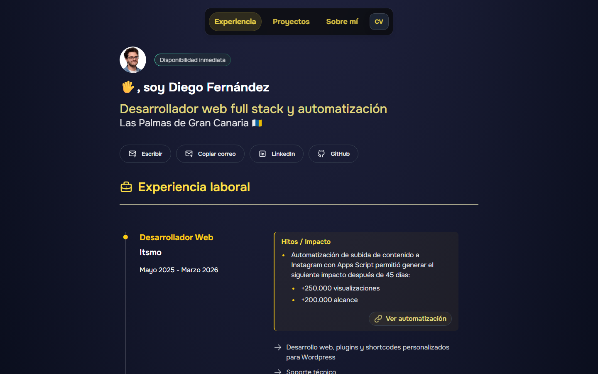

# Porfolio

Porfolio personal construido con Astro 5.7.13 y salida estática. Stack: TypeScript estricto, Tailwind CSS 3.4, View Transitions (`<ClientRouter />`) y la tipografía variable Onest. El sitio se publica en GitHub Pages automáticamente al hacer push a `main`.



## Comandos

| Comando           | Acción                                                                 |
| :---------------- | :--------------------------------------------------------------------- |
| `npm install`     | Instala las dependencias del proyecto.                                 |
| `npm run dev`     | Inicia el servidor de desarrollo local en `http://localhost:4321`.     |
| `npm run host`    | Alias de `dev` que expone el servidor en la red local (`--host`).      |
| `npm run build`   | Ejecuta `astro check` y compila la versión de producción en `./dist/`. |
| `npm run preview` | Sirve `./dist/` localmente para verificar la build antes de desplegar. |
| `npm run format`  | Aplica Prettier (incluye el plugin `Astro`) a todo el proyecto.        |

## Estructura

```
src/
├── components/        Componentes Astro (cabecera, footer, items de experiencia, etc.)
│   ├── shared/        Cabecera, Hero, Footer, iconos y tech-icons
│   ├── formacion/     Items de la colección `formacion`
│   ├── proyectos/     Render de proyectos y sus recursos (imagen o vídeo)
│   └── recomendacion/ Popups de recomendaciones
├── content/           Content collections tipadas con Zod (ver `config.ts`)
│   ├── experiencia/   Archivos .md de cada empleo
│   ├── formacion/     Archivos .md de cada estudio
│   └── proyectos/     Una carpeta por proyecto con `index.md` y sus assets
├── data/              Datos estáticos: navegación, categorías, etiquetas, filtros
├── layouts/           Layout base
├── pages/             Páginas del sitio (`index`, `projects`, `about`)
├── styles/            Estilos globales (Tailwind)
└── utils/             Helpers: markdown, diálogos, reproducción de vídeos
```

Las carpetas `local/`, `dist/`, `node_modules/` y `.astro/` se ignoran en este resumen: la primera contiene utilidades de desarrollo (ver [CV local](#cv-local-solo-desarrollo)) y el resto son artefactos generados.

## Añadir contenido

Todo el contenido del sitio vive en `src/content/` y se valida con los esquemas Zod definidos en `src/content/config.ts`. Crea el archivo, respeta los campos obligatorios y el build fallará si algo no encaja.

### Nueva experiencia

Crea `src/content/experiencia/<slug>.md`:

```yaml
---
title: Desarrollador Web
company: 21ninjas
date: Abril 2024 - Octubre 2024
order: 3
extra: false
---
```

Campos disponibles (todos opcionales salvo `title`, `company`, `date`, `order`): `companyDetail`, `blockquote`, `descriptions`, `descriptionList`, `impact`, `links`. Marca `extra: true` si la entrada debe aparecer bajo "Experiencia adicional". El esquema completo está en `src/content/config.ts`.

### Nueva formación

Crea `src/content/formacion/<slug>.md`:

```yaml
---
title: Desarrollo de Aplicaciones Web
company: IES
date: 2022 - 2024
description: Formación oficial en desarrollo web.
order: 1
---
```

Campos opcionales: `url`, `files`. Esquema completo en `src/content/config.ts`.

### Nuevo proyecto

Crea una carpeta `src/content/proyectos/<slug>/` con un `index.md`:

```yaml
---
title: Mi Proyecto
category: personales
descriptions:
  - Descripción corta del proyecto.
resource:
  type: imagen
  alt: Captura del proyecto
  fit: encajar
tags:
  - HTML5
  - CSS3
  - JS
order: 1
---
```

Assets en la misma carpeta, con el nombre del slug:

- `<slug>.webp` — obligatorio (imagen preview).
- `<slug>.mp4` — solo si `resource.type` es `video`. En ese caso también se requieren `accessibleLabel`, `width` y `height`.

`category` acepta `corporativos`, `pruebas-tecnicas` o `personales`. `fit` acepta `recortar` o `encajar`.

> **Añadir una etiqueta nueva** requiere tocar tres sitios: añadir el valor al enum `z.enum([...])` de `tags` en `src/content/config.ts`, crear el icono SVG correspondiente en `src/components/shared/tech-icons/` (un componente por etiqueta) y registrar la entrada en `src/data/etiquetas.ts`.

## CV local (solo desarrollo)

Si en `.env` defines `LOCAL_CV_MANAGER=true` y arrancas con `npm run dev`, el plugin `local/cv/vite-plugin.js` sirve los CVs imprimibles bajo `/local/cv/*` y muestra un botón flotante **CV** en la cabecera. En producción (build o `NODE_ENV !== 'development'`) esas rutas devuelven 404 y el botón desaparece.

## Deploy

Push a `main` → GitHub Actions ejecuta `.github/workflows/deploy.yml` (build con `withastro/action@v2`) y publica el resultado en GitHub Pages.

## Licencia

MIT © 2024–2026 Diego Fernández. Basado en [midudev/porfolio.dev](https://github.com/midudev/porfolio.dev).
